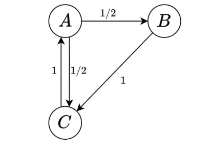
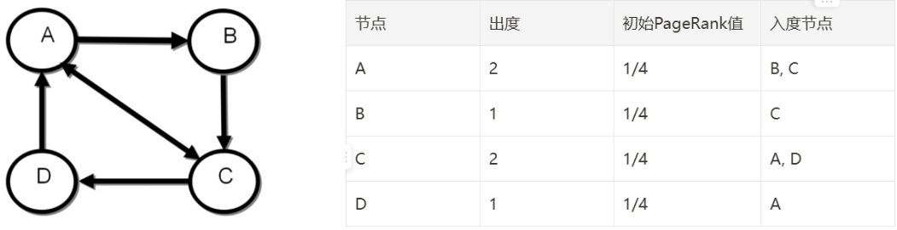
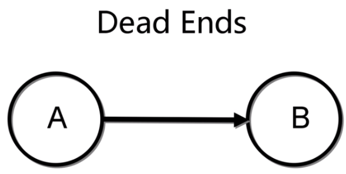
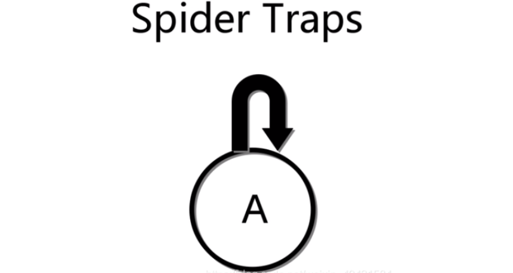

 

   <div style="text-align: center;">
    
</div>
<center style="font-size: 1.2rem; line-height: 1.8;">
  <br> <div style="
      font-size: 1.8rem;
      letter-spacing: 0.2em;
      margin-bottom: 1.2rem;
  ">
  计 算 机 学 院
  </div>
  <div style="
      font-size: 1.3rem;
      letter-spacing: 0.3em;
      margin-bottom: 2rem;
  ">
    大数据计算及应用实验报告
  </div>
  <!-- 上方横线 -->
  <hr style="
      width: 60%;
      border: none;
      height: 1px;
      background: #ccc;
      margin: 1.5rem auto 0.5rem;
  ">
  <!-- 标题 -->
  <h1 style="
      font-size: 2rem;
      letter-spacing: 0.12em;
      margin: 0.5rem 0 0.5rem;
      text-align: center;
      line-height: 1.3;
      font-weight: 480;
      color: #34495e;
  ">
PA2-冯诺依曼计算机系统
  </h1>
  <!-- 下方横线 -->
  <hr style="
      width: 60%;
      border: none;
      height: 1px;
      background: #ccc;
      margin: 0.5rem auto 2rem;
  ">
  姓名：胡进喆 原敬闰 张明昆<br>
  学号：2213045 2211771 2211585<br>
  专业：计算机科学与技术 物联网工程<br>
  指导老师：杨征路 <br><br><br><br><br><br><br>
  日期：2025 年 4 月 27 日<br><br><br><br>
</center>


# 摘要

[TOC]


## 基本概念


### 背景介绍

随着互联网的飞速发展，全球信息量呈现指数级增长。据统计，截至2023年，全球已有超过20亿个活跃网站和数千亿个网页。在如此庞大的信息海洋中，如何高效、准确地获取所需信息，成为了用户和技术人员共同关注的焦点。传统的搜索技术难以满足用户对速度和精度的要求，信息过载和信息迷航的问题日益凸显。

为了解决这一挑战，Google在20世纪90年代末推出了PageRank算法。这一革命性的网页排名算法基于网页之间的链接关系，评估每个网页的“重要性”或“权威性”，从而提高搜索结果的相关性和质量。PageRank的引入**不仅提升了搜索引擎的性能，也在很大程度上推动了互联网信息检索技术的发展。**

### 中心思想

PageRank算法的核心思想是利用互联网网页之间的链接关系，评估每个网页的重要性或权威性：

- **链接投票机制**：每个网页都被视为一个节点，网页之间的超链接被视为节点之间的边。当一个网页链接到另一个网页时，相当于对其进行了一次“投票”。这些投票用于衡量被链接网页的重要性。

- **权重传递**：投票的权重并非一视同仁。一个网页所赋予的投票权重取决于其自身的重要性（即PageRank值）和出链数量。如果一个高权重的网页链接到某个网页，那么该链接将对目标网页的重要性产生更大的影响。

- **迭代计算**：PageRank值的计算是一个迭代的过程，通过多次重复计算，直到PageRank值收敛，得到每个网页的稳定排名。

可以将整个互联网视为一个巨大的有向图 ，基于这个视角，我们可以构建一个随机游走模型，也就是一阶马尔可夫链。在这个模型中，我们假设一个虚拟的网页浏览者会随机地、按照等概率地跟随一个页面上的任何一个超链接到另一个页面，并持续这种随机跳转。在长时间内，这种随机跳转的行为会形成一个稳定的模式，**即马尔可夫链的平稳分布。**每个网页的 PageRank 值，实际上就是在这个平稳分布中的概率。



观察上述图，核心概念有：

- **入链** ：链接到某个网页的所有其他网页。入链数量和质量是决定该网页PageRank值的重要因素。

- **出链** ：从某个网页链接到的所有其他网页。一个网页的PageRank值会通过其出链分散到被链接的网页上。


直观上，一个网页，如果指向该网页的超链接越多，随机跳转到该网页的概率也就越高，该网页的PageRank值就越高，这个网页也就越重要。一个网页，如果指向该网页的PageRank值越高，随机跳转到该网页的概率也就越高，该网页的PageRank值就越高，这个网页也就越重要。PageRank值依赖于网络的拓扑结构，一旦网络的拓扑(连接关系)确定，PageRank值就确定。

## 实验环境


### 编程语言选择

经过技术指标和评分维度的综合分析，我们小组最终**采用C++实现**作为实验的编程平台，以下是C++与Python的对比分析：

|评估维度|C++方案优势|Python方案风险|
|-|-|-|
|**内存控制**|手动内存管理+STL容器优化，可精准控制内存碎片|依赖第三方库的内存实现，存在隐性内存开销|
|**执行速度**|原生编译优化+OpenMP并行， 突破时间限制|解释器性能瓶颈，大规模矩阵运算可能超时|
|**内存优化**|可定制化实现块状存储、压缩稀疏矩阵等底层结构|受限于scipy.sparse的预设格式，灵活性较低|
|**跨平台部署**|静态编译生成独立可执行文件，兼容性极佳|需处理Python环境依赖，打包存在版本兼容风险|
|**学术展示**|展示底层优化细节，易体现技术深度|依赖库函数的黑箱操作，技术细节展示受限|

选择C++方案可在满足严苛技术指标的同时，最大限度展示计算系统的优化能力，同时还可避免Python**内存泄露陷阱、类型转换开销**等较难控制的风险，是较为良好的技术方案。


### 数据集说明

本次实验的数据集为 data.txt，其数据格式为每行按照的方式进行存储，表示图中存在从结点 srcNodeID 到结点 dstNodeID 的一条边。我们编写代码对数据集进行详细的统计，得到如下表格：

|**统计类别**|**统计项**|**数值**|**统计类别**|**统计项**|**数值**|
|-|-|-|-|-|-|
|**节点统计**|总节点数|9500|**入度统计** |平均入度|15.7895|
||最小节点ID|0||最大入度|33.0000|
||最大节点ID|9999||最小入度|2.0000|
|**边统计**|总边数（包括重复边）|150000|**出度统计（不包含无出度节点）**|平均出度|17.6471|
||唯一边数|150000||最大出度|38.0000|
||重复边数|0||最小出度|4.0000|
|**死胡同节点统计**| 节点数|1000|**无入度节点统计**|节点数|0|
|| 节点比例|10.5263%||节点比例|0%|

该数据集构建的图结构具有较为均衡的入度和出度分布，节点和边的数量都较多，表明图的连接较为密集； 所有边都是唯一的，不存在重复边，即无需进行额外的去重工作；

还需注意的是，最小出度为4，说明该数据集不存在与其他节点之间无 out-links的结点，即Spider Traps。 而死胡同节点比例较高（约 10.5%），在后续计算 PageRank 时需要考虑死胡同节点的影响。


### 实验配置


## PageRank


### 算法概述

1. 初始化所有网页的 PageRank 值和为 1.0，每个网页的 PageRank 相等，都为 1/N； 

2. 根据网页之间的链接关系计算出每个网页的出度；

3. 使用迭代计算每个网页的 PageRank 值，直到达到一定的收敛条件；

4. 对所有网页的 PageRank 值进行归一化处理，使得它们的和等于 1

其基本公式为：

$ \tag{1}PR (v_0) = \frac{1}{N}$

$\tag{2}PR(v_i) = \sum_{v_j \in M(v_i)} \frac{PR(v_j)}{L(v_j)}, \quad i = 1, 2, \cdots, n$

- PR(vi​) 是页面 vi​ 的 PageRank 值。 

- M(vi​) 是链接到页面 vi​ 的所有页面的集合。

- L(vj​) 是页面 vj​ 的出链数量。

- N(n) 是页面的总数。

为了更好的说明，我们给出迭代示例，左图为有向图，右图为各节点信息表格：



初始化的PR值为 1/N = 1/4 。每个页面都应该将其重要性均匀地转移到它链接到的页面上。一般来说，如果一个节点有 k 个外向边，它会将其重要性传递给它链接到的每 个节点。而在第一轮迭代PR(C)的值为：

$PR(C)_1 = \frac{PR(A)_0}{L(A)} + \frac{PR(B)_0}{L(B)} = \frac{\frac{1}{4}}{2} + \frac{\frac{1}{4}}{1} = \frac{3}{8}$

而其他节点计算形式都是如此， 此处不再计算，第两轮结果为：

|节点|初始PR|第一轮PR|第二轮PR|
|-|-|-|-|
|A|0.25|0.375|0.3125|
|B|0.25|0.125|0.1875|
|C|0.25|0.375|0.3125|
|D|0.25|0.125|0.1875|

其中，收敛条件通常是设置一个误差阈值，当两次迭代之间所有节点的 PageRank 值差的绝 对值均小于该误差阈值时，算法停止迭代：

$\tag{3}\| PR^{(k+1)} - PR^{(k)} \| < \epsilon \quad (\epsilon \text{ 为预设的精度}$


PageRank算法在建模过程中需严谨处理两个关键问题：**其一，网页出度的计算需包含自环链接的影响，确保转移概率矩阵的完备性；其二，针对孤立节点引发的吸收态问题，采用随机跳转机制引入遍历性保障。**







左图的B没有任何出链（out-links）这就是 Dead Ends，Dead Ends 会导致网站权重变为 0。而右图的A 节点与其他节点之间无 out-links，这就是 Spider Traps，这将会导致网站权重变为向一个节点偏移。


为此，算法引入阻尼因子d构建随机浏览模型，其中d=0.85表征用户遵循超链接浏览的概率，而补偿项(1−d)/N则反映以均匀概率N0.15​随机访问任意节点的行为，有效解决了等级泄露（Rank Leak）和等级沉没（Rank Sink）的收敛障碍。

修正后的PageRank方程可表述为：

$\tag{4}PR(v_i) = d \left( \sum_{v_j \in M(v_i)} \frac{PR(v_j)}{L(v_j)} \right) + \frac{1 - d}{n}, \quad i = 1, 2, \cdots, n$

- d 是阻尼因子，通常设置为 0.85。

第二项称为平滑I页，由于采用平滑项，所有结点的 PageRank 值都不会为 0。至此，我们又可以重新迭代网页的权重计算了，数学定理已证明，最终 PageRank 随机能够收敛。


在实际应用中，为了方便比较和解释，通常会对最终的PageRank值进行归一化处理，使得所有网页的PageRank值之和为1：

$\tag{5}PR_{\text{normalized}} = \frac{PR}{\sum_{i=1}^{N} PR(v_i)}$

### 具体实现


## **Sparse Matrix** & Block-stripe


### 算法概述

#### 初始版本中的问题

- **数据结构导致的内存消耗问题：**初始版本中使用如下数据结构

    ```C++
    unordered_map<int, vector<int>> in_links; // 记录每个节点的入链表
    unordered_map<int, int> out_degree;       // 记录每个节点的出度
    unordered_set<int> nodes;                 // 所有出现过的节点集合
    ```

    unordered_map和vector的组合在存储和访问时会有比较大的开销，且map键值存储需要进行额外的哈希计算，效率很低。

- **对边进行去重时的内存开销**

    由于我们不能保证数据集中的边数据不会重复，所以需要在读取数据的时候对重复的边进行去重，而初始版本的算法中使用unordered_set来存储边，但是其中进行的哈希运算会引入额外的内存和运算开销

- 对于死胡同节点的处理操作

    初始版本直接将出度为0的节点显式的连接到所有节点，然而这样会使得邻接表的内存占用大幅度增加，如果图的规模过大，甚至会出现内存不足的情况

- 计算时的不连续访问及遍历开销

    初始版本计算的代码如下：

    ```C++
    for (int node : nodes) {
        double sum_in = 0.0;
        for (int src : in_links[node]) {
            sum_in += pr[src] / out_degree[src];
        }
        pr_new[node] = (1.0 - DAMPING) / N + DAMPING * sum_in;
    }
    ```

    此处遍历邻接表时，访问的模式是不连续的，这会导致缓存的命中率极低，导致额外的时间开销。

    且每次迭代都要遍历所有节点和边，效率极低。

综上所述，我们使用CSR稀疏矩阵以及块矩阵优化方式来重新设计算法

#### CSR稀疏矩阵格式

CSR（Compressed Sparse Row，压缩稀疏行）是一种高效存储稀疏矩阵的数据结构，CSR 格式通过只存储非零元素及其位置，避免了存储大量的零值，从而节省内存并提高计算效率。

**例子如下：**

对于如下矩阵

```C++
0  5  0  0
3  0  0  0
0  0  0  7
0  0  1  0
```

- 如果使用二维数组来存储，就需要存储所有16个元素，其中有12个0

- 而使用稀疏矩阵只需要存储四个非零元素和行列位置，节省了大量空间

CSR 格式将稀疏矩阵分为三个部分存储：

1. **`values`**：

    - 存储所有非零元素的值，按行的顺序依次存储。

    - 例如，上述矩阵的非零元素是 `[5, 3, 7, 1]`。

1. **`col_idx`（列索引）**：

    - 存储每个非零元素所在的列号。

    - 例如，上述矩阵中非零元素的列号是 `[1, 0, 3, 2]`。

1. **`row_ptr`（行指针）**：

    - 存储每一行的非零元素在 `values` 数组中的起始位置。

    - 例如：

        - 第 0 行的非零元素从 `values[1]` 开始。

        - 第 1 行的非零元素从 `values[0]` 开始。

        - 第 2 行的非零元素从 `values[3]` 开始。

        - 第 3 行的非零元素从 `values[2]` 开始。

    - 对应的 `row_ptr` 是 `[1, 0, 3, 2, 4]`（注意：最后一个值是非零元素的总数，用于计算范围）。

#### **块矩阵优化（分块计算）**

在现实应用中，pagerank计算的数据集往往很大，转移矩阵的维度为N×N，对于大规模的图（例如数十亿节点），矩阵无法直接载入到内存中进行计算，并且原始的计算方案会引入许多从内存读取数据到cache乃至从硬盘读取数据到内存的额外开销，导致算法的效率极低，而且原始的计算方案会限制分布式计算资源的使用，因此采用分块的计算方案来优化pagerank算法非常重要。

#### **分块矩阵的核心思想**

将转移矩阵M和节点集划分为多个逻辑块，每一个块都对应了一个子矩阵和子向量，从而计算可分块独立进行，最后合并结果

分块矩阵格式如下：


$M = \begin{bmatrix}
B_{11} & B_{12} & \cdots & B_{1K} \\
B_{21} & B_{22} & \cdots & B_{2K} \\
\vdots & \vdots & \ddots & \vdots \\
B_{K1} & B_{K2} & \cdots & B_{KK}
\end{bmatrix}, \quad
\mathbf{pr} = \begin{bmatrix}
\mathbf{v}_1 \\
\mathbf{v}_2 \\
\vdots \\
\mathbf{v}_K
\end{bmatrix}$

**矩阵划分和子块定义：**

将节点集划分为K个子集，并构建子矩阵，每个子矩阵B_ij包含从块i到块j的所有边，若块i有n_i个节点，块j有n_j个节点，则B_ij的维度为n_j×n_i。

假设节点分为3块（K = 3)，则：

$M = 
\begin{bmatrix}
B_{11} & B_{12} & B_{13} \\
B_{21} & B_{22} & B_{23} \\
B_{31} & B_{32} & B_{33}
\end{bmatrix}$

块 B_12​ 存储从块1节点到块2节点的所有转移概率。

**分块后的PageRank迭代公式**

将全局公式分解为块级计算：1j​ 是块 j 的全1向量，每个块的更新仅依赖其他块的PageRank子向量 vi(k)​。

$\mathbf{v}_j^{(k+1)} = \frac{1-d}{N} \mathbf{1}_j + d \sum_{i=1}^{K} B_{ji} \cdot \mathbf{v}_i^{(k)}$

**分块后，局部性增强**：每个块的计算可独立进行，适合分布式并行，计算某个块的时候仅需加载当前块的子矩阵和关联的子向量。

那么综上所述，我们

#### 优化设计

$\mathbf{pr}^{(k+1)} = \frac{1-d}{N} \mathbf{1} + d \cdot \left( \sum_{i=1}^{K} B_{1i} \mathbf{v}_i^{(k)}, \sum_{i=1}^{K} B_{2i} \mathbf{v}_i^{(k)}, \dots, \sum_{i=1}^{K} B_{Ki} \mathbf{v}_i^{(k)} \right)^T$

$n^2 \cdot \text{sizeof(double)} \leq M$

$P = 
\begin{bmatrix}
\begin{array}{c|c}
B_{11} & B_{12} \\
\hline
B_{21} & B_{22}
\end{array}
\end{bmatrix}$

### 具体实现


## 参考文献

1. Brin, S., & Page, L. (1998). *The Anatomy of a Large-Scale Hypertextual Web Search Engine*. Computer Networks and ISDN Systems, 30(1-7), 107-117.

2. Langville, A. N., & Meyer, C. D. (2006). *Google’s PageRank and Beyond: The Science of Search Engine Rankings*. Princeton University Press.

3. Page, L., Brin, S., Motwani, R., & Winograd, T. (1999). *The PageRank Citation Ranking: Bringing Order to the Web*. Stanford InfoLab.

4. Haveliwala, T. H. (2002). *Topic-Sensitive PageRank*. Proceedings of the 11th International Conference on World Wide Web, 517-526.

5. Gyongyi, Z., Garcia-Molina, H., & Pedersen, J. (2004). *Combating Web Spam with TrustRank*. Proceedings of the 30th International Conference on Very Large Data Bases, 576-587.


