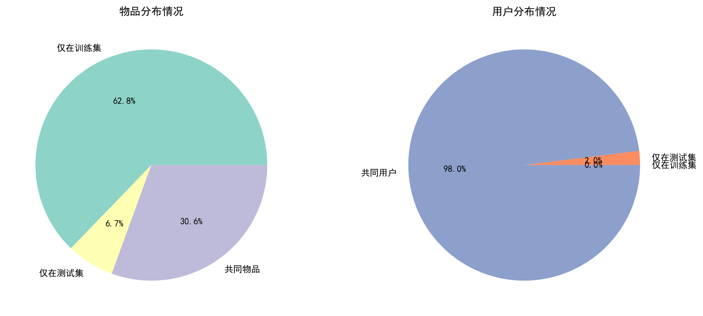

   <div style="text-align: center;">
    
</div>
<center style="font-size: 1.2rem; line-height: 1.8;">
  <br> <div style="
      font-size: 1.8rem;
      letter-spacing: 0.2em;
      margin-bottom: 1.2rem;
  ">
  计 算 机 学 院
  </div>
  <div style="
      font-size: 1.3rem;
      letter-spacing: 0.3em;
      margin-bottom: 2rem;
  ">
    大数据计算及应用实验报告
  </div>
  <!-- 上方横线 -->
  <hr style="
      width: 60%;
      border: none;
      height: 1px;
      background: #ccc;
      margin: 1.5rem auto 0.5rem;
  ">
  <!-- 标题 -->
  <h1 style="
      font-size: 2rem;
      letter-spacing: 0.12em;
      margin: 0.5rem 0 0.5rem;
      text-align: center;
      line-height: 1.3;
      font-weight: 480;
      color: #34495e;
  ">
期末作业 RecommendationSystems
  </h1>
  <!-- 下方横线 -->
  <hr style="
      width: 60%;
      border: none;
      height: 1px;
      background: #ccc;
      margin: 0.5rem auto 2rem;
  ">
  姓名：胡进喆 原敬闰 张明昆<br>
  学号：2213045 2211771 2211585<br>
  专业：计算机科学与技术 物联网工程<br>
  指导老师：杨征路 <br><br><br><br><br><br><br>
  日期：2025 年 6 月 5 日<br><br><br><br>
</center>


# 摘要


[TOC]


## 实验背景


## 实验原理

**协同过滤推荐**（Collaborative Filtering recommendation）是在信息过滤和信息系统中正迅速成为一项很受欢迎的技术。与传统的基于内容过滤直接分析内容进行 推荐不同，协同过滤分析用户兴趣，在用户群中找到指定用户的相似（兴趣）用户，**综合这些相似用户对某一信息的评价，形成系统对该指定用户对此信息的喜好程度预测。协同过滤算法主要分为基于启发式和基于模型式两种。 其中，**基于启发式的协同过滤算法，又可以分为基于用户的协同过滤算法 （User-Based）和基于项目的协同过滤算法（Item-Based）。


## 数据集说明

我们编写`data_analysis.py`对数据集进行统计分析，得到如下结果：

### train.txt

数据集概览为：

|       属性       | 数值   | 属性         | 数值     |
| :--------------: | ------ | ------------ | -------- |
|     评分数量     | 90,854 | 用户数量     | 598      |
| 用户平均评分数量 | 151.93 | 物品数量     | 9,077    |
| 物品平均评分数量 | 10.01  | 用户ID范围   | 1~610    |
|     评分均值     | 69.88  | 数据集稀疏度 | 98.33%   |
|    评分标准差    | 20.78  | 物品ID范围   | 1~193609 |

从用户 ID 范围来看，最小用户 ID 为 1，最大用户 ID 为 610，表明**用户 ID 是连续且紧密分布的**。物品 ID 范围从 1 到 193609，呈现出较大的跨度，与物品数量（9077）对比，**说明物品 ID 存在明显不连续的情况**。每个用户的平均评分数量为 151.93 条，表明数据集中用户参与评分的活跃度较高。反观物品维度，平均每个物品仅获得约 10.01 个评分。这揭示了物品的受欢迎程度分布不均，多数物品可能仅获得少数用户关注，长尾效应显著，部分冷门物品的评分稀缺可能影响推荐算法对这些物品的准确评估。

评分的均值为 69.88，标准差为 20.78，表明评分数据整体上呈现出较为集中的趋势，但也有一定程度的波动。从分位数来看，中位数为 70，25% 分位数为 60，75% 分位数为 80。这暗示着评分分布**可能呈现出一定的正偏态**，即多数评分集中在中高分段，低分段的评分数量相对较少。

评分稀疏度高达 0.9833，即数据矩阵中约 98.33% 的位置是空缺的，**这在推荐系统中属于非常高的稀疏度水平**，给模型训练带来了极大的挑战，需要采用有效的矩阵填充或降维方法。

下表展示了各评分值的出现频率：

| 评分值 | 出现次数 | 评分值 | 出现次数 |
| ------ | -------- | ------ | -------- |
| 10     | 1221     | 60     | 18119    |
| 20     | 2552     | 70     | 11996    |
| 30     | 1603     | 80     | 24177    |
| 40     | 6852     | 90     | 7742     |
| 50     | 5067     | 100    | 11525    |

从上表可以看出，**高分值（如 60、80、100）的出现频率明显高于低分值。**评分 80 出现次数最多，达到 24177 次，占总评分数的约 26.6%，而评分 10 的出现次数最少，仅占约 1.34%。这种评分分布表明用户在评分时更倾向于给出中高分评价，可能反映出数据集整体质量较高，或者存在用户评分偏乐观的倾向。

### test.txt

同样，对测试集进行分析得到如下结果：

|   属性   | 数值 | 属性       | 数值     |
| :------: | ---- | ---------- | -------- |
| 评分数量 | 9982 | 用户ID范围 | 1~610    |
| 用户数量 | 610  | 物品ID范围 | 1~193565 |
| 物品数量 | 3618 |            |          |

从数据规模上来看，test集覆盖了完整的用户ID范围（1-610），但包含3618个物品，仅占完整物品ID范围（1-193565）的约1.87%，这表明测试集在物品维度上具有较高的稀疏性，物品覆盖率较低，**这反映了推荐系统在实际应用中面临的冷启动问题**。

因此我们对训练集和测试集进行冷处理分析，得到如下图表：



 上述饼图直观展示了训练集与测试集在物品和用户分布上的差异：左图显示，约62.8%的物品仅出现在训练集，30.6%的物品为训练集和测试集共有，仅有6.7%的物品为测试集独有，说明测试集存在比例为17.88%的冷启动物品；右图则表明，绝大多数用户（98.03%）在训练集和测试集中均有出现，只有极少数用户为测试集独有，用户冷启动问题并不突出。整体来看，**推荐系统在物品维度面临更为显著的冷启动挑战，而用户维度的数据分布则较为充分。**


## 协同过滤基础算法


### User-Based CF

User-Based协同过滤（User-Based Collaborative Filtering，简称User-Based CF）是一种基于群体智慧的核心推荐方法，其思想源于"**相似用户可能对未交互项目具有相近的偏好**"。该方法通过分析用户历史行为数据，挖掘用户间的相似性关系，并利用相似用户对目标项目的评分来预测目标用户的潜在兴趣。

#### 算法原理

User-Based CF的输入依赖于用户对项目的显式或隐式反馈数据。显式反馈（主动评分）包括用户直接对商品、电影等项目的评分或评价 ，而隐式反馈（被动评分）则通过用户行为（如购买记录、浏览时长、点击率）间接反映兴趣强度。例如，电子商务场景中，用户的购买行为天然构成隐式评分矩阵，其中购买频次或金额可量化为评分值。这些数据被组织为**用户-项目评分矩阵**，矩阵中的**每个元素*Ru,i*表示用户𝑢对项目𝑖的评分**，未评分的项目则作为待预测目标。

 

==**相似度计算**==  核心假设是相似用户对同一项目的评分具有一致性。为此，需定义用户间相似性度量方法，常见算法包括：

皮尔逊相关系数：  衡量两位用户评分趋势的线性相关性，通过消除用户评分尺度偏差（如部分用户习惯性打高分或低分）提升相似度准确性。公式为：
$$
\sin(u,v)=\frac{\sum_{i\in I_{uv}}(R_{u,i}-\bar{R}_u)(R_{v,i}-\bar{R}_v)}{\sqrt{\sum_{i\in I_{uv}}(R_{u,i}-\bar{R}_u)^2}\sqrt{\sum_{i\in I_{uv}}(R_{v,i}-\bar{R}_v)^2}}
$$

- 其中，𝐼𝑢𝑣为用户𝑢与𝑣 共同评分的项目集合，𝑅_𝑢 、𝑅_𝑣 为各自的平均评分。皮尔逊系数范围在[-1,1]，值越大表示用户偏好越相似。

余弦相似度：  将用户评分视作向量，计算其夹角的余弦值以衡量方向相似性，适合处理稀疏数据。公式为：
$$
\sin(u,v)=\frac{\sum_{i\in I_{uv}}R_{u,i}\cdot R_{v,i}}{\sqrt{\sum_{i\in I_{uv}}R_{u,i}^2}\cdot\sqrt{\sum_{i\in I_{uv}}R_{v,i}^2}}
$$

- 调整后的余弦相似度进一步考虑项目平均评分，消除热门项目的高评分偏差，公式中每个评分减去对应项目的平均分𝑅ˉ𝑖*R*ˉ*i*。

选择相似度方法需结合数据特性：若用户评分存在明显尺度差异（如严格型与宽容型用户），皮尔逊系数更优；若需快速处理高维稀疏数据，余弦法更为高效。


==**评分预测**== 确定目标用户𝑢的最近邻集合𝑁(𝑢)（即相似度最高的𝑘个用户）后，预测其对未评分项目𝑖的兴趣分值。预测公式为加权平均：
$$
\hat{R}_{u,i}=\bar{R}_u+\frac{\sum_{v\in N(u)}\sin(u,v)\cdot(R_{v,i}-\bar{R}_v)}{\sum_{v\in N(u)}|\sin(u,v)|}
$$

- 此公式通过引入用户平均评分𝑅_𝑢 、𝑅_𝑣 消除个体评分偏差，并利用相似度作为权重，强调高相似用户的评分影响。最终，系统按预测分值降序推荐Top-N项目给用户。

User-Based CF的优势在于直观性强，能够发现长尾项目，但面临计算复杂度高（用户数远大于项目数）、冷启动（新用户数据稀疏）等挑战。其适用于用户规模相对稳定、用户行为数据丰富的场景（如电商、社交平台），尤其在隐式反馈场景中，通过行为日志构建评分矩阵，可有效捕捉用户偏好动态变化。


#### 代码实现

==**数据预处理与矩阵构建**== User-Based协同过滤的数据预处理与矩阵构建过程是推荐系统实现的核心基础。其核心目标是将原始评分数据转化为结构化矩阵表示，为后续的相似度计算和预测提供高效的数据支撑。整个处理流程可分为数据加载、特征工程和矩阵化转换三个阶段：

数据加载阶段采用双层字典结构进行原始数据存储。通过遍历训练文件，以用户行为为中心建立双向索引：**当读取到"用户|..."格式行时，记录当前用户上下文**；后续**非空行解析为<物品ID 评分>键值对，分别存入user_ratings和item_ratings两个defaultdict构成的嵌套字典**。这种设计既保留了用户维度的完整评分记录，又建立了物品维度的反向索引，为后续矩阵构建提供双向查询能力。典型实现如：

```python
with open(train_file) as f:
    for line in f:
        if '|' in line:  # 用户上下文切换
            current_user = int(line.split('|')[0])
        else:  # 评分记录解析
            item, score = map(int, line.split())
            self.user_ratings[current_user][item] = score
            self.item_ratings[item][current_user] = score
```

特征工程阶段着重于数据标准化处理。针对每个用户的评分记录计算均值评分，该均值将用于后续相似度计算时的评分中心化处理（如皮尔逊相关系数需要扣除用户评分偏差）。此处的均值计算采用numpy向量化操作，避免循环带来的性能损耗：

```python
self.mean_ratings = {
    user: np.mean(list(ratings.values())) 
    for user, ratings in self.user_ratings.items()
}
```

矩阵化转换阶段构建用户-物品的二维评分矩阵。首先建立双向索引映射：将原始用户ID和物品ID分别映射为矩阵的行列索引，通过字典结构实现O(1)复杂度的ID查找。随后初始化零值矩阵，遍历用户评分字典填充有效评分。这种稀疏矩阵表示方法既压缩了存储空间，又保持了矩阵运算的便利性：

```python
# 建立索引映射
self.user_to_idx = {user: idx for idx, user in enumerate(users)}
self.item_to_idx = {item: idx for idx, item in enumerate(items)}

# 矩阵填充
for user, ratings in self.user_ratings.items():
    user_idx = self.user_to_idx[user]
    for item, rating in ratings.items():
        if item in self.item_to_idx:  # 过滤未出现在物品索引中的条目
            item_idx = self.item_to_idx[item]
            self.user_item_matrix[user_idx, item_idx] = rating
```

最终形成的用户-物品评分矩阵作为特征空间的基础表示，使得相似度计算可转化为矩阵运算问题。例如余弦相似度通过标准化后的矩阵点积实现，而皮尔逊相关系数则需先进行均值中心化处理。这种矩阵化表示不仅提高了计算效率，更重要的是将推荐问题转化为可量化的向量空间中的邻近度计算问题，为后续的邻居选择和评分预测奠定了数学基础。


==**相似度计算**== User-Based协同过滤的相似度计算本质上是将用户行为数据映射到向量空间，通过量化向量间几何关系来建立用户相似性度量。其数学核心在于构建用户评分向量并定义合适的距离函数，其中余弦相似度与皮尔逊相关系数是两种最具代表性的空间映射方法。

余弦相似度直接采用原始评分向量计算空间夹角余弦值，适用于显式评分数据且不考虑用户评分尺度差异的场景。代码实现借助sklearn的优化矩阵运算：

```python
def cosine_similarity(matrix):
    # 使用sklearn的cosine_similarity函数
    return cosine_similarity(matrix)
```

皮尔逊相关系数则通过统计学视角改进相似度度量，其计算分为三个关键步骤：首先进行均值中心化消除用户评分偏差；随后通过标准差标准化将向量缩放到可比尺度；最终执行协方差计算。该方法的代码实现显式展现其数学本质：

```python
def pearson_similarity(matrix):
    mean = np.mean(matrix, axis=1, keepdims=True)
    centered = matrix - mean
    std = np.sqrt(np.sum(centered ** 2, axis=1, keepdims=True))
    std[std == 0] = 1
    normalized = centered / std
    return np.dot(normalized, normalized.T)
```

两种方法均通过矩阵运算实现高效计算，**其中皮尔逊方法通过中心化处理能更准确捕捉用户间相对评分模式，而余弦相似度保留原始评分绝对值差异。**在工程实现中，需特别注意零方差用户的处理——当用户所有评分相同时，皮尔逊分母为零会导致计算异常，代码通过标准差掩码替换巧妙规避了该问题。相似度矩阵的生成本质上构建了用户关系的拓扑图，其质量直接决定后续近邻选择的准确性，是影响推荐效果最关键的数学变换。


==**冷启动处理**== 协同过滤系统在处理冷启动问题时，主要面临两种情况：新用户冷启动和新物品冷启动。在我们的实现中，通过引入全局平均评分（global mean rating）来优雅地处理这两种情况。首先，在模型训练阶段，我们计算并存储全局平均评分：

```python
# 在fit方法中计算全局平均分
all_ratings = []  # 存储所有评分用于计算全局平均分
for user in self.user_ratings:
    for item, score in self.user_ratings[user].items():
        all_ratings.append(score)
self.global_mean_rating = np.mean(all_ratings) if all_ratings else 0
```

在预测阶段，当遇到新用户或新物品时，系统会进行冷启动检查。这个检查过程非常关键，它需要同时验证用户和物品是否在训练集中：

```python
def predict(self, user_id, item_id):
    # 冷启动处理：如果用户或物品不在训练集中，返回全局平均分
    if item_id not in self.item_to_idx or user_id not in self.user_to_idx:
        return self.global_mean_rating
```

这种处理方式的优势在于：全局平均评分能够反映整个评分系统的整体水平，它比单独使用用户平均分或物品平均分更加合理。在预测过程中，如果找不到足够的相似用户或相似物品，系统也会使用全局平均分作为默认值：

```python
# 当没有找到足够的相似用户/物品时
if not similar_users:  # 或 if not similar_items:
    return self.global_mean_rating

# 当相似度加权和为0时
if denominator == 0:
    return self.global_mean_rating
```


==**模型预测与评估**==  User-Based协同过滤的预测评分计算是基于近邻用户的加权偏差调整过程，其数学本质是通过相似用户的评分模式对目标用户的潜在偏好进行线性估计。当预测用户u对物品i的评分时，算法首先在用户相似度矩阵中定位目标用户的近邻集合，该集合需满足双重约束：**相似度超过预设阈值且对目标物品有历史评分记录。**通过相似度排序截取Top-N邻居后，**执行偏差修正的加权平均计算——每个邻居的贡献由其与目标用户的相似度加权**，同时扣除该邻居的平均评分偏差以消除个体评分尺度差异。具体实现如代码所示：

```python
# 偏差调整计算核心逻辑
numerator = 0
denominator = 0
for other_user_id, similarity in similar_users:
    rating = self.user_ratings[other_user_id][item_id]
    numerator += similarity * (rating - self.mean_ratings[other_user_id])  # 偏差调整项
    denominator += abs(similarity)  # 相似度正则化

predicted_rating = self.mean_ratings[user_id] + numerator / denominator
```

评估 User-Based CF 模型的性能通常使用验证集来进行。主要的评估指标包括`平均绝对误差`（Mean Absolute Error, MAE）和`均方根误差`（Root Mean Square Error, RMSE）。这些指标能够量化模型预测评分与真实评分之间的差异。

在评估过程中，模型读取验证集文件，逐行处理用户和物品的评分记录。对于每个用户物品对 (u, i)，模型预测用户 u 对物品 i 的评分，并与真实评分进行比较。通过计算预测评分与真实评分的绝对误差及其平方误差，累积所有误差后计算 MAE 和 RMSE。

```python
 with open(validation_file, 'r', encoding='utf-8') as f:
            for line in f:
                line = line.strip()
                if '|' in line:  # 用户行
                    current_user, _ = line.split('|')
                    current_user = int(current_user)
                else:  # 评分行
                    if line:
                        item_id, true_rating = line.split()
                        item_id = int(item_id)
                        true_rating = int(true_rating)
                        predicted_rating = self.predict(current_user, item_id)
                        error = abs(predicted_rating - true_rating)
                        mae += error
                        rmse += error ** 2
                        count += 1
        if count > 0:
            mae /= count
            rmse = np.sqrt(rmse / count)
```


### Item-Based CF

Item-Based协同过滤（Item-Based CF）的核心假设是**相似物品可能获得同一用户的相近评分**。与User-Based CF的用户相似性驱动不同，其以物品为分析主体，通过挖掘物品间的共现评分模式构建推荐模型。输入数据同样基于用户-物品评分矩阵，但建模焦点转向物品维度，构建**物品-用户评分矩阵**，矩阵元素*R_{i,u}*表示用户𝑢对物品𝑖的评分，未评分项作为预测目标。

#### 算法原理

物品相似性度量聚焦于共同评分用户的偏好一致性，主要方法和user_CF相同，分为**余弦相似度**，直接计算物品评分向量的夹角余弦；**皮尔逊相关系数**，消除用户评分偏差，将评分中心化处理。其公式分别为：


$$
\sin(i,j)=\frac{\sum_{u\in U_{ij}}R_{i,u}\cdot R_{j,u}}{\sqrt{\sum R_{i,u}^2}\cdot\sqrt{\sum R_{j,u}^2}}\quad\sin(i,j)=\frac{\sum_{u\in U_{ij}}(R_{i,u}-\bar{R}_u)\cdot(R_{j,u}-\bar{R}_u)}{\sqrt{\sum(R_{i,u}-\bar{R}_u)^2}\cdot\sqrt{\sum(R_{j,u}-\bar{R}_u)^2}}
$$

其中，𝑈𝑖𝑗为同时对物品𝑖和𝑗评分的用户集合，𝑅_𝑢为用户𝑢的平均评分。相似度计算后形成物品相似度矩阵，用于后续邻居选择。预测用户𝑢对目标物品𝑖的评分时，执行两个步骤：1.**相似物品筛选**：从物品相似度矩阵中提取与𝑖最相似的𝑘个物品（阈值过滤后），构成邻居集合𝑁(𝑖)；2.**加权评分聚合**：基于用户𝑢对𝑁(𝑖)中物品的历史评分，计算加权预测值：
$$
   \hat{R}_{u,i}=\bar{R}_i+\frac{\sum_{j\in N(i)}\sin(i,j)\cdot(R_{u,j}-\bar{R}_j)}{\sum|\sin(i,j)|}
$$

其中，𝑅_𝑖为物品𝑖的平均评分，通过引入物品平均分消除热门物品的评分偏差。最终评分通过截断处理约束在合理范围（如0-100）。**冷启动处理**策略与User-Based CF对称：若目标物品或用户未出现在训练集中，直接返回全局平均分；若用户未对任何相似物品评分，则依赖物品平均分或全局均值填补。

Item-Based CF适用于**物品数量相对稳定、用户行为动态性强**的场景（如新闻推荐、短视频流），其优势包括：

- **计算效率高**：物品数通常远小于用户数，相似度矩阵规模更小；
- **实时性优**：物品相似度可离线预计算，在线预测仅需局部加权；
- **隐式反馈适配**：通过用户行为频次构建物品关联，增强可解释性。

与User-Based CF形成互补，二者可根据业务特性选择或融合，以平衡推荐多样性、时效性与计算开销。


#### 代码实现

> 注意：ItemCF在代码实现上和UserCF大抵相似，鉴于篇幅，下述只列举部分关键代码

在数据加载与预处理层面，ItemCF首先从训练文件中加载用户-物品评分数据，构建物品-用户评分矩阵。这一步与UserCF类似，但ItemCF更关注物品之间的相似性,构建的是***物品-用户评分矩阵***。

```python
        # 填充评分矩阵
for item in self.item_ratings:
    item_idx = self.item_to_idx[item]
    for user, rating in self.item_ratings[item].items():
        if user in self.user_to_idx:
            user_idx = self.user_to_idx[user]
            self.item_user_matrix[item_idx, user_idx] = rating
```


ItemCF的核心是计算物品之间的相似度。与UserCF不同，ItemCF使用**物品-用户评分矩阵**来计算物品相似度。

```python
# 计算物品相似度矩阵
if self.similarity_method == 'cosine':
    self.item_similarity = cosine_similarity(self.item_user_matrix)
elif self.similarity_method == 'pearson':
    self.item_similarity = pearson_similarity(self.item_user_matrix)
else:
    raise ValueError(f"不支持的相似度计算方法: {self.similarity_method}")
```


ItemCF的预测逻辑与UserCF不同。ItemCF通过用户已评分的物品来预测未评分物品的评分。具体来说，对于目标物品，找到与之最相似的物品，并根据用户对这些相似物品的评分来预测目标物品的评分。

```python
def predict(self, user_id, item_id):
    # 冷启动处理：如果用户或物品不在训练集中，返回全局平均分
    if item_id not in self.item_to_idx or user_id not in self.user_to_idx:
        return self.global_mean_rating

    item_idx = self.item_to_idx[item_id]
    user_idx = self.user_to_idx[user_id]

    # 获取物品的相似物品
    similar_items = []
    for other_item_idx, similarity in enumerate(self.item_similarity[item_idx]):
        if other_item_idx != item_idx and similarity > self.min_similarity:
            other_item_id = self.idx_to_item[other_item_idx]
            if other_item_id in self.user_ratings[user_id]:
                similar_items.append((other_item_id, similarity))

    # 按相似度排序并选择top-N个邻居
    similar_items.sort(key=lambda x: x[1], reverse=True)
    similar_items = similar_items[:self.n_neighbors]

    # 计算预测评分
    numerator = 0
    denominator = 0
    for other_item_id, similarity in similar_items:
        rating = self.user_ratings[user_id][other_item_id]
        numerator += similarity * (rating - self.mean_ratings[other_item_id])
        denominator += abs(similarity)

    predicted_rating = self.mean_ratings[item_id] + numerator / denominator
    return max(0, min(100, predicted_rating))  # 确保评分在0-100之间
```


**总结：**UserCF和ItemCF均基于协同过滤框架，分别通过用户-物品矩阵与物品-用户矩阵建模。UserCF计算用户间余弦/皮尔逊相似度，筛选高相似邻居用户，结合其评分偏差加权预测目标用户对物品的偏好，通过用户平均评分与全局均值处理冷启动；ItemCF则构建物品相似度网络，基于用户历史评分与相似物品的评分偏差聚合预测值，利用物品平均分进行校准。二者均采用MAE/RMSE评估预测误差，核心差异在于UserCF侧重用户行为关联性，而ItemCF聚焦物品共现模式，分别通过矩阵转置实现双向推荐逻辑。


### Slope one

Slope One算法是一种简单而高效的协同过滤推荐算法，由Daniel Lemire和Anna Maclachlan于2005年首次提出。该算法的核心思想基于一个重要的观察：**不同用户对同一对商品的评分差异往往保持相对稳定。**换句话说，如果用户A对商品i的评分比对商品j的评分高2分，那么其他用户对这两个商品的评分差异也很可能接近2分。**这种基于评分差异的线性关系**假设使得Slope One算法能够通过计算商品间的平均评分差异来进行有效的评分预测，而无需进行复杂的矩阵分解或相似度计算。

Slope One算法的名称来源于其预测模型的数学形式，该模型可以表示为一条斜率为1的直线。与传统的协同过滤算法相比，Slope One算法具有计算简单、易于理解和实现的特点，同时在许多实际应用场景中能够取得令人满意的推荐效果。该算法特别适用于用户评分数据相对稠密且评分差异模式较为稳定的推荐系统。

#### 算法原理

Slope One算法的核心在于计算和维护商品间的平均评分差异。对于任意两个商品i和j，算法首先计算所有同时对这两个商品进行过评分的用户的评分差异，然后求取这些差异的平均值作为商品i和j之间的偏差值。数学上，商品i相对于商品j的平均偏差可以表示为：
$$
dev(i,j) = Σ(u∈S(i,j)) (r_ui - r_uj) / |S(i,j)|
$$
- 其中，S(i,j)表示同时对商品i和j进行过评分的用户集合，r_ui和r_uj分别表示用户u对商品i和j的评分，|S(i,j)|表示集合S(i,j)的大小。这个偏差值反映了用户群体对商品i相对于商品j的整体偏好程度。

基于计算得到的商品间偏差值，Slope One算法可以预测用户u对未评分商品i的评分。预测公式采用加权平均的方式，考虑用户u已评分的所有商品与目标商品i之间的偏差关系：
$$
r̂_ui = (Σ(j∈R_u) (r_uj + dev(i,j)) × |S(i,j)|) / (Σ(j∈R_u) |S(i,j)|)
$$
- 其中，R_u表示用户u已经评分过的商品集合。在这个预测公式中，每个已评分商品j对预测结果的贡献由两部分组成：用户u对商品j的实际评分r_uj，以及商品i相对于商品j的平均偏差dev(i,j)。权重|S(i,j)|表示计算偏差值dev(i,j)时使用的样本数量，样本数量越多，对应的偏差值越可靠，因此在预测中应该给予更高的权重。

#### 代码实现

Slope One算法的实现过程相对简单直观，主要分为两个阶段：预计算阶段和预测阶段。在预计算阶段，算法需要遍历所有的用户评分数据，计算每对商品之间的平均偏差值。这个过程的时间复杂度为O(n²m)，其中n是商品数量，m是用户数量。虽然这个复杂度看似较高，但由于预计算只需要进行一次，且结果可以持久化存储，因此在实际应用中是可以接受的。

```python
class SlopeOne(AlgoBase):

    def __init__(self):

        AlgoBase.__init__(self)

    def fit(self, trainset):

        cdef int n_items = trainset.n_items

        cdef long [:, ::1] freq = np.zeros((trainset.n_items, trainset.n_items), np.int_)
        cdef double [:, ::1] dev = np.zeros((trainset.n_items, trainset.n_items), np.double)
        cdef int u, i, j, r_ui, r_uj

        AlgoBase.fit(self, trainset)

        for u, u_ratings in trainset.ur.items():
            for i, r_ui in u_ratings:
                for j, r_uj in u_ratings:
                    freq[i, j] += 1
                    dev[i, j] += r_ui - r_uj

        for i in range(n_items):
            dev[i, i] = 0
            for j in range(i + 1, n_items):
                dev[i, j] /= freq[i, j]
                dev[j, i] = -dev[i, j]

        self.freq = np.asarray(freq)
        self.dev = np.asarray(dev)

        self.user_mean = [np.mean([r for (_, r) in trainset.ur[u]])
                          for u in trainset.all_users()]

        return self
```

在预测阶段，当需要为用户u预测对商品i的评分时，算法会查找用户u已评分的所有商品，然后利用这些商品与目标商品i之间的预计算偏差值来生成预测评分。这个过程的时间复杂度为O(|R_u|)，其中|R_u|是用户u已评分的商品数量。由于大多数用户的评分商品数量相对有限，因此预测过程通常很快。

```py
    def estimate(self, u, i):

        if not (self.trainset.knows_user(u) and self.trainset.knows_item(i)):
            raise PredictionImpossible('User and/or item is unknown.')

        Ri = [j for (j, _) in self.trainset.ur[u] if self.freq[i, j] > 0]
        est = self.user_mean[u]
        if Ri:
            est += sum(self.dev[i, j] for j in Ri) / len(Ri)

        return est
```

为了进一步提高算法的性能和准确性，研究者们提出了Slope One算法的几种变体。加权Slope One算法在原始公式的基础上引入了额外的权重因子，以更好地处理评分数据的不均匀分布问题。双向Slope One算法同时考虑了商品i到商品j和商品j到商品i的偏差，通过双向预测的方式提高预测精度。


## 矩阵分解模型


### SVD


#### 算法原理

==**损失函数**== 在传统的SVD矩阵分解方法中，算法的核心目标是通过最小化预测评分与实际评分之间的平方误差来学习用户和商品的潜在特征向量。具体而言，SVD算法的损失函数可以表示为：
$$
L = Σ(u,i)∈R (r_ui - p_u^T q_i)^2 + λ(||p_u||^2 + ||q_i||^2)
$$

这个损失函数的第一项代表了预测误差的平方和，其中`r_ui`是用户u对商品i的实际评分，`p_u^T q_i`是通过矩阵分解得到的预测评分。第二项是L2正则化项，通过引入正则化参数λ来控制模型复杂度，防止过拟合现象的发生。正则化项的作用在于约束用户特征向量`p_u`和商品特征向量`q_i`的范数，使得模型能够更好地泛化到未见过的数据上。


==**正则化SVD引入**== 在稀疏数据条件下，观测到的评分集合 RRR 相对较小，容易导致传统SVD模型出现过拟合。为了解决这一问题，需要在损失函数中引入正则化项，使模型在拟合训练数据的同时保持适当的复杂度。基于此思路，正则化SVD（RSVD）的完整目标函数可以写成：
$$
\min_{p_u, q_i} \sum_{(u,i) \in R} \left( r_{ui} - \sum_{k=1}^{K} p_{u,k} q_{k,i} \right)^2 + \frac{\lambda}{2} \sum_{u} \| p_u \|^2 + \frac{\lambda}{2} \sum_{i} \| q_i \|^2
$$

- 其中 λ>0  是正则化参数，用于平衡模型拟合程度与复杂度。

- 通过加上 $\frac{\lambda}{2} \sum_{u} \| p_u \|^2 + \frac{\lambda}{2} \sum_{i} \| q_i \|^2$ ，RSVD 在保证拟合效果的同时，降低了参数过大导致的过拟合风险。

==**优化方法**== 对于上述目标函数，常见的求解方法包括：**迭代最小二乘（ALS）**：交替固定 {pu} 或{qi} 进行优化，直至收敛。虽然原理清晰，但对于大规模数据集而言，实现较为繁琐、效率不够高。**随机梯度下降（SGD）**：针对每个训练样本 (u,i) ，计算预测误差  ，然后沿梯度反方向更新参数。

#### 代码实现

SVD算法是推荐系统中最著名的矩阵分解方法，在Netflix Prize竞赛中由Simon Funk推广而闻名。该算法的核心预测公式基于用户和物品的偏置以及潜在因子的内积计算。当不使用偏置时，算法等价于概率矩阵分解方法。

```python
class SVD(AlgoBase):

    def __init__(self, n_factors=100, n_epochs=20, biased=True, init_mean=0,
                 init_std_dev=.1, lr_all=.005,
                 reg_all=.02, lr_bu=None, lr_bi=None, lr_pu=None, lr_qi=None,
                 reg_bu=None, reg_bi=None, reg_pu=None, reg_qi=None,
                 random_state=None, verbose=False):

        self.n_factors = n_factors
        self.n_epochs = n_epochs
        self.biased = biased
        self.init_mean = init_mean
        self.init_std_dev = init_std_dev
        self.lr_bu = lr_bu if lr_bu is not None else lr_all
        self.lr_bi = lr_bi if lr_bi is not None else lr_all
        self.lr_pu = lr_pu if lr_pu is not None else lr_all
        self.lr_qi = lr_qi if lr_qi is not None else lr_all
        self.reg_bu = reg_bu if reg_bu is not None else reg_all
        self.reg_bi = reg_bi if reg_bi is not None else reg_all
        self.reg_pu = reg_pu if reg_pu is not None else reg_all
        self.reg_qi = reg_qi if reg_qi is not None else reg_all
        self.random_state = random_state
        self.verbose = verbose

        AlgoBase.__init__(self)
```

在代码实现中，算法通过随机梯度下降(SGD)来最小化正则化平方误差。关键的参数配置包括n_factors用于设定潜在因子数量（默认100），n_epochs控制SGD迭代次数（默认20次）。算法支持biased参数来决定是否使用偏置项，当设为False时可获得无偏版本。

```python
    def fit(self, trainset):

        AlgoBase.fit(self, trainset)
        self.sgd(trainset)

        return self
```

用户和物品因子的初始化遵循正态分布，可通过init_mean和init_std_dev参数调节均值和标准差。学习率控制通过lr_all统一设置（默认0.005），或者分别为不同参数类型设置lr_bu、lr_bi、lr_pu、lr_qi。正则化参数同样支持统一设置reg_all（默认0.02）或分别配置。

训练完成后，算法会生成四个重要属性：pu表示用户因子矩阵（n_users × n_factors），qi表示物品因子矩阵（n_items × n_factors），bu和bi分别表示用户和物品偏置向量。

```python
    def estimate(self, u, i):
        # Should we cythonize this as well?

        known_user = self.trainset.knows_user(u)
        known_item = self.trainset.knows_item(i)

        if self.biased:
            est = self.trainset.global_mean

            if known_user:
                est += self.bu[u]

            if known_item:
                est += self.bi[i]

            if known_user and known_item:
                est += np.dot(self.qi[i], self.pu[u])

        else:
            if known_user and known_item:
                est = np.dot(self.qi[i], self.pu[u])
            else:
                raise PredictionImpossible('User and item are unknown.')

        return est
```


### SVD++

然而，传统的SVD方法存在一个显著的局限性，即它仅仅考虑了显式的评分信息，而忽略了用户在系统中产生的大量隐式反馈信息。在实际的推荐系统应用场景中，用户的隐式行为数据（如商品浏览记录、购买历史、点击行为等）往往比显式评分更加丰富和容易获取。基于这一观察，SVD++算法应运而生，它在传统SVD的基础上融合了隐式反馈信息，从而能够更全面地建模用户的偏好模式。

#### 算法原理

==**预测评分公式**== SVD++算法的核心创新在于将用户的隐式反馈信息整合到评分预测模型中。该算法认为，即使用户没有对某个商品给出明确的评分，但用户与该商品的交互行为仍然能够反映用户的潜在兴趣。基于这一思想，SVD++算法重新定义了评分预测公式：

$$
\hat{r}_{ui} = \mu + b_u + b_i + \left( p_u + |I_u|^{-1/2} \sum_{j \in I_u} y_j \right)^T q_i
$$

在这个公式中，预测评分不再仅仅依赖于用户和商品的基本特征向量，而是引入了多个重要的改进元素。首先，`μ`代表了整个系统的全局平均评分，它反映了所有用户对所有商品的整体评价趋势。其次，`b_u`和`b_i`分别表示用户u和商品i的偏置项，这些偏置项能够捕捉个体用户和商品相对于全局平均水平的系统性偏差。 

更为重要的是，SVD++算法在用户特征向量`p_u`的基础上增加了隐式反馈项`|I_u|^(-1/2) Σ(j∈I_u) y_j`。这里，`I_u`表示用户u有过交互行为的商品集合，`y_j`是商品j对应的隐式反馈因子向量，而`|I_u|^(-1/2)`是归一化因子，用于消除不同用户交互商品数量差异带来的影响。这种设计使得算法能够从用户的历史行为模式中推断出用户的潜在偏好，即使这些偏好没有通过显式评分表达出来。

==**损失函数与正则化**== 为了学习上述模型中的所有参数，需要在损失函数中同时对显式与隐式部分进行约束。完整的目标函数可以表示为：
$$
\begin{aligned}
L \;=\; &\sum_{(u,i)\in R}\left[r_{ui} \;-\; \mu \;-\; b_u \;-\; b_i \;-\;\Bigl(p_u + |I_u|^{-\frac{1}{2}} \sum_{j\in I_u} y_j\Bigr)^{\T!}\,q_i\right]^2 \\
&\;+\;\lambda\left(\|p_u\|^2 + \|q_i\|^2 + \|y_j\|^2 + b_u^2 + b_i^2\right)
\end{aligned}
$$

- 第一项为预测误差的平方和，涵盖了显式评分与融合了隐式反馈后的预测值之差。

- 第二项为正则化项，对显式特征向量 pu,  qi、隐式反馈因子 yj 以及偏置 bu, bi 一并加以约束，防止模型过拟合。

==**随机梯度下降**==  SVD++ 通常采用随机梯度下降（SGD）来优化上述损失函数。对于每一条训练样本 (u,i)(u,i)(u,i)，首先计算预测误差：
$$
e_{ui} = r_{ui} - \hat{r}_{ui} = r_{ui} - \Bigl[\mu + b_u + b_i + \Bigl(p_u + |I_u|^{-\frac{1}{2}} \sum_{j \in I_u} y_j\Bigr)^T q_i\Bigr].
$$
然后，根据梯度信息更新各项参数。随机梯度更新方式保证了在大规模数据集上具有较高的计算效率，同时能够有效避免陷入局部最优。

相比于传统SVD（或RSVD）只针对评分矩阵进行分解，**SVD++ 由于要处理额外的隐式反馈信息，因此计算量有所增加**，但这部分开销是合理且必要的：在实际推荐场景中，隐式反馈极大地提升了模型的预测精度和推荐质量，尤其在数据稀疏、长尾物品较多的情况下优势更加明显。


####  代码实现

SVD++算法是SVD的扩展版本，其创新之处在于考虑了隐式评分信息。该算法引入了新的物品因子yj来捕获隐式评分，即用户对物品进行评分这一行为本身，而不考虑具体评分值。

```python
class SVDpp(AlgoBase):

    def __init__(self, n_factors=20, n_epochs=20, init_mean=0, init_std_dev=.1,
                 lr_all=.007, reg_all=.02, lr_bu=None, lr_bi=None, lr_pu=None,
                 lr_qi=None, lr_yj=None, reg_bu=None, reg_bi=None, reg_pu=None,
                 reg_qi=None, reg_yj=None, random_state=None, verbose=False,
                 cache_ratings=False):

        self.n_factors = n_factors
        self.n_epochs = n_epochs
        self.init_mean = init_mean
        self.init_std_dev = init_std_dev
        self.lr_bu = lr_bu if lr_bu is not None else lr_all
        self.lr_bi = lr_bi if lr_bi is not None else lr_all
        self.lr_pu = lr_pu if lr_pu is not None else lr_all
        self.lr_qi = lr_qi if lr_qi is not None else lr_all
        self.lr_yj = lr_yj if lr_yj is not None else lr_all
        self.reg_bu = reg_bu if reg_bu is not None else reg_all
        self.reg_bi = reg_bi if reg_bi is not None else reg_all
        self.reg_pu = reg_pu if reg_pu is not None else reg_all
        self.reg_qi = reg_qi if reg_qi is not None else reg_all
        self.reg_yj = reg_yj if reg_yj is not None else reg_all
        self.random_state = random_state
        self.verbose = verbose
        self.cache_ratings = cache_ratings

        AlgoBase.__init__(self)
```

在代码参数配置上，SVD++的n_factors默认值调整为20，学习率lr_all默认设为0.007。算法新增了cache_ratings参数来决定是否在训练时缓存评分数据，这能加速训练但会增加内存占用。与SVD相比，SVD++增加了lr_yj和reg_yj参数来控制隐式因子的学习率和正则化。

训练后的模型会额外生成yj属性，表示隐式物品因子矩阵（n_items × n_factors），这与显式的qi因子矩阵配合使用，提升了预测准确性。

```python
    def estimate(self, u, i):

        est = self.trainset.global_mean

        if self.trainset.knows_user(u):
            est += self.bu[u]

        if self.trainset.knows_item(i):
            est += self.bi[i]

        if self.trainset.knows_user(u) and self.trainset.knows_item(i):
            Iu = len(self.trainset.ur[u])  # nb of items rated by u
            u_impl_feedback = (sum(self.yj[j] for (j, _)
                               in self.trainset.ur[u]) / np.sqrt(Iu))
            est += np.dot(self.qi[i], self.pu[u] + u_impl_feedback)

        return est
```


### NMF

非负矩阵分解（Non-Negative Matrix Factorization, NMF）是一种重要的数据分析技术，其核心思想是将大规模数据集分解为更小且具有实际意义的组成部分，同时确保所有数值保持非负性。这种约束条件使得NMF在提取数据中有用特征方面表现出色，并且大大简化了数据的分析和处理过程。与传统的矩阵分解方法相比，NMF的非负性约束更符合许多实际应用场景的物理意义，例如在图像处理中像素值不能为负，在文本分析中词频不能为负等情况。

#### 算法原理

==**矩阵分解**== 对于一个维度为m × n的矩阵A，其中每个元素都大于等于0，NMF算法将其分解为两个矩阵W和H，这两个矩阵的维度分别为m × k和k × n，且两个矩阵都只包含非负元素。这种分解关系可以用数学公式表示为：
$$
A \approx W H, \quad W \in \mathbb{R}_{\geq 0}^{m \times k}, \, H \in \mathbb{R}_{\geq 0}^{k \times n}, \quad k \leq \min(m, n).
$$
这里，k 称为分解秩，通常取值远小于 min⁡(m,n) ，以实现降维和去噪的效果。矩阵 W 的每一列可以看作若干“基础模式”或“特征向量”，这些向量共同组成原始数据中存在的潜在结构；而 H 的每一列则记录了对应原始列向量（如某条样本或某个文档）在这些基础模式下的权重。由于两者都仅允许非负元素，因此分解结果可被直观解释为“将原始数据用若干个非负基础部分按加权叠加的方式重构”。


==**重构误差 **== 要使 W H 尽可能接近 A ，N 通常采用最小化 Frobenius 范数的重构误差：
$$
\min_{W \geq 0, H \geq 0} \|A - W H\|_F^2 = \min_{W \geq 0, H \geq 0} \sum_{i=1}^{m} \sum_{j=1}^{n} \left( A_{ij} - [W H]_{ij} \right)^2,
$$
并要求 Wiℓ≥0,  Hℓj≥0 。由于这个优化问题是非凸的，通常只能找到局部最优解。在实际求解过程中，首先需要为 W 和 H 赋予非负的初始值，常见做法包括从均匀分布或正态分布（取绝对值）中采样，或者基于截断 SVD 等启发式方法进行初始化。良好的初始化有助于加速收敛并减少陷入较差局部最优的概率。

==**迭代更新**== 随后进入迭代更新阶段，以逐步减少 ∥A−WH∥。这里最经典的优化技术是**乘法更新规则**：
$$
W_{il} \leftarrow W_{il} \times \frac{[A H^T]_{il}}{[W H H^T]_{il}},
H_{\ell j} \leftarrow H_{\ell j} \times \frac{[W^T A]_{\ell j}}{[W^T W H]_{\ell j}}.
$$


每次更新后，W 与 H 都保持非负，并且 ∥A−WH∥在迭代过程中单调不增。通常交替执行若干次上述更新，直至满足如下任一停止条件：重构误差变化幅度低于预设阈值、达到最大迭代次数，或其他用户自定义的收敛标准。

另一个常用的方法是**交替最小二乘法（ALS）**。其思路是固定 H  后，将$\min_{W \geq 0} \|A - W H\|_F^2$     转化为“带非负约束的最小二乘”子问题，通过合适的 NNLS 方法求得最优 W；接着固定新得到的 W ，以同样方式求解$\min_{H \geq 0} \|A - W H\|_F^2$   子问题获得 H ，然后再回到第一步循环。交替迭代直到收敛。ALS 在处理大规模、稀疏数据时往往比乘法更新收敛更快，但需要调用 NNLS 求解器。

==**应用场景**== 从直觉与应用角度来看，NMF 的关键在于“**以非负并且可解释的方式，将复杂数据拆解为若干有意义的部件再加权组合**”。这使得它特别适合的场景为：**人脸图像分解 文本主题建模  音频信号分离**。

正是因为 NMF 保持了“非负”“部分叠加”的直观含义，并能够揭示出数据中隐藏的局部结构，它在图像、文本、音频等多个领域都得到了广泛且有效的应用。

 


#### 代码实现

NMF算法基于非负矩阵分解理论，确保所有用户和物品因子保持非负值。该算法的预测公式与SVD相似，但通过特殊的梯度下降步长选择来维持因子的非负性约束。

```py
class NMF(AlgoBase):

    def __init__(self, n_factors=15, n_epochs=50, biased=False, reg_pu=.06,
                 reg_qi=.06, reg_bu=.02, reg_bi=.02, lr_bu=.005, lr_bi=.005,
                 init_low=0, init_high=1, random_state=None, verbose=False):

        self.n_factors = n_factors
        self.n_epochs = n_epochs
        self.biased = biased
        self.reg_pu = reg_pu
        self.reg_qi = reg_qi
        self.lr_bu = lr_bu
        self.lr_bi = lr_bi
        self.reg_bu = reg_bu
        self.reg_bi = reg_bi
        self.init_low = init_low
        self.init_high = init_high
        self.random_state = random_state
        self.verbose = verbose

        if self.init_low < 0:
            raise ValueError('init_low should be greater than zero')

        AlgoBase.__init__(self)
```

在参数设置上，NMF的n_factors默认值较小（15），但n_epochs增加到50次以确保充分收敛。算法默认不使用偏置（biased=False），但可以启用偏置版本来提高准确性，尽管这可能增加过拟合风险。

NMF的关键配置包括reg_pu和reg_qi（默认0.06）来控制用户和物品因子的正则化，以及init_low和init_high（默认0到1）来设置因子初始化范围。由于算法对初始值高度敏感，这两个参数的调节需要格外谨慎。

```python
    def estimate(self, u, i):
        # Should we cythonize this as well?

        known_user = self.trainset.knows_user(u)
        known_item = self.trainset.knows_item(i)

        if self.biased:
            est = self.trainset.global_mean

            if known_user:
                est += self.bu[u]

            if known_item:
                est += self.bi[i]

            if known_user and known_item:
                est += np.dot(self.qi[i], self.pu[u])

        else:
            if known_user and known_item:
                est = np.dot(self.qi[i], self.pu[u])
            else:
                raise PredictionImpossible('User and item are unknown.')

        return est
```

这三种算法都支持random_state参数来控制随机数生成，确保结果的可重现性，并提供verbose参数来显示训练进度。在实际应用中，开发者需要根据具体数据特征和性能要求来选择合适的算法和参数配置，以获得最佳的推荐效果。


## 图模型与集成方法


### Graph CF

基于图的协同过滤将推荐问题转化为图上的相似度传播问题，**通过随机游走计算用户和物品之间的相似度**，并利用相似度和统计信息进行评分预测。这种方法能够捕获用户-物品交互的复杂结构，从而提供准确的推荐。

#### 算法原理

算法将**用户-物品交互关系建模为二部图（bipartite graph）**，通过图上的相似性传播实现推荐。其核心思想是将用户和物品视为图节点，评分行为视为边，利用图结构捕捉高阶相似性。以下是算法的核心原理：

==**图构建**==  首先，我们构建一个二部图 `𝐺=(𝑈∪𝐼,𝐸)` ，其中 𝑈 是用户节点集合，𝐼 是物品节点集合，𝐸 是连接用户和物品的边的集合。每条边 (𝑢,𝑖)  表示用户 𝑢 对物品 𝑖 有过评分，边的权重通常与评分值相关。在此次实现中，权重被设计为归一化后的评分的绝对值，并乘以一个与用户和物品评分标准差相关的因子（以考虑评分分布的差异）。具体而言，权重计算如下：
$$
\mathrm{weight}(u,i)=|r_{ui}|\times(1+0.1\times(\sigma_u+\sigma_i))
$$

- 其中 R𝑢𝑖 是归一化后的评分 ，𝜎𝑢 和 𝜎𝑖 分别是用户 𝑢 和物品 𝑖 的评分标准差。这样设计权重可以使得评分分布较广的用户或物品对相似度传播有更大的影响。

==**转移概率矩阵**== 构建一个转移概率矩阵 𝑃 来描述图中节点间的转移概率。矩阵 𝑃 的大小为 `(∣𝑈∣+∣𝐼∣)×(∣𝑈∣+∣𝐼∣)` 。对于每个用户节点 𝑢，其指向物品节点 𝑖 的转移概率为：
$$
P_{u\to i}=\frac{\mathrm{weight}(u,i)}{\sum_{j\in N(u)}\mathrm{weight}(u,j)}
$$

- 其中 𝑁(𝑢)  是用户 𝑢 评分过的物品集合。同样，从物品节点 𝑖 指向用户节点 𝑢 的转移概率也类似，此处省略。

==**随机游走**== 随机游走过程用于计算节点之间的相似度。这里采用带重启的随机游走（Random Walk with Restart, RWR），其思想是：从一个节点出发，以概率 𝛼 按照转移概率矩阵进行游走，以概率 1−𝛼 跳回起始节点（重启）。通过多次迭代，可以计算一个节点到其他节点的访问概率，这些概率可以解释为节点间的相似度。迭代公式为：
$$
S^{(t+1)}=\alpha\cdot S^{(t)}\cdot P+(1-\alpha)\cdot I
$$

- 其中 𝑆(𝑡) 是第 𝑡 步的相似度矩阵，𝐼 是单位矩阵（表示重启时回到自身）。初始时 𝑆(0)=𝐼 。经过 𝑛 次迭代后，得到的 𝑆(𝑛) 即为最终的相似度矩阵。 这个相似度矩阵 scores 记录了任意两个节点之间的相似度。

==**评分预测**== 对于给定的用户 𝑢  和物品 𝑖 ，我们利用随机游走得到的相似度分数 score 进行预测。预测公式综合考虑了用户平均评分、物品平均评分以及相似度分数：
$$
\hat{r}_{ui}=\mu_u+\beta\cdot\mathrm{score}_{u,i}\cdot\sigma_u+\gamma\cdot(\mu_i-\mu_\mathrm{global})
$$

- 其中 μ𝑢 是用户 𝑢  的平均评分，σ𝑢 是用户 𝑢 的评分标准差， μ𝑖 是物品 𝑖  的平均评分， μ*global*  是全局平均评分。在代码中，系数 𝛽  取0.7，𝛾取0.3。最后，将预测评分限制在评分范围内（如0到100）。

基于图的协同过滤能够捕捉**用户和物品之间的高阶关系（通过多步游走）**，而传统的协同过滤（如基于邻域的方法）通常只考虑直接邻居。该方法对稀疏数据有较好的鲁棒性，因为随机游走能够通过多次跳转探索更广泛的连接。需要注意的是，该算法的计算复杂度主要在于转移概率矩阵的构建和随机游走的迭代，当用户和物品数量很大时，矩阵可能非常大，**迭代计算会消耗较多内存和时间**。


#### 代码实现

基于图的协同过滤算法的代码实现主要细节如下：

首先，在 `_normalize_ratings` 中，算法先汇集所有评分计算全局均值，然后针对每个用户与每件物品分别计算均值与标准差，保证评分分布信息被保留又能消除量纲影响。这样用 Z-score 归一化后，不会因为某个用户或物品评分方差过小而导致数值爆炸。

```python
all_ratings = [r for ur in self.user_ratings.values() for r in ur.values()]
self.global_mean = np.mean(all_ratings) if all_ratings else 0
for user_id, ratings in self.user_ratings.items():
    self.user_mean_ratings[user_id] = np.mean(ratings.values())
    self.user_std[user_id] = max(np.std(ratings.values()), 1.0)
# 归一化
normalized = (rating - user_mean) / user_std
```


接着在 `_build_graph` 中，构造一个无向二部图，用户和物品分别作为两类节点，通过编号映射 `user_map`、`item_map` 与反向映射保证能在后续矩阵中定位。添加边时，以归一化评分绝对值加权，再略微放大用户与物品评分波动对权重的影响,这种设计既体现了评分强度，又兼顾了评分的离散程度:

```python
weight = abs(rating) * (1 + 0.1 * (self.user_std[user_id] + self.item_std[item_id]))
self.G.add_edge(f"u_{user_id}", f"i_{item_id}", weight=weight)
```


随后在 `_build_transition_matrix` 中，算法在大小为 `(n_users + n_items)` 的方阵中填充转移概率。对每个用户到其评分物品的边，按权重占比归一化，并对称地将概率赋给物品到用户：

```python
total = sum(weights)
self.P[u_idx, i_idx] = weight / total
self.P[i_idx, u_idx] = weight / total
```


核心的随机游走在 `_random_walk` 中迭代完成，融合了重启机制与传播机制，在每次迭代更新中既保留了原始意义的身份矩阵，又不断吸纳网络中新的评分关联：

```python
scores = np.eye(n)
for _ in range(self.n_iter):
    scores = self.alpha * scores.dot(self.P) + (1 - self.alpha) * np.eye(n)
```

经过 `n_iter` 次迭代后，`scores[u, i]` 即衡量了用户与物品间的关联强度。


最后在 `predict` 方法中，当要预测某用户对某物品的评分时，先从 `scores` 中读取二者的随机游走得分，再结合用户自身评分分布与物品相对全局的偏移做线性融合，并裁剪到 `[min_rating, max_rating]` 范围：

```python
score = self.scores[u_idx, i_idx]
pred = user_mean + score * user_std * 0.7 + (item_mean - self.global_mean) * 0.3
pred = max(self.min_rating, min(self.max_rating, pred))
```

这种融合充分利用了全局、用户和物品三个层面的统计信息，既有图结构挖掘的相似度，又兼顾了用户与物品的固有评分倾向。


### TopKNan CF


#### 算法原理

==TopKNanCF==是一种**集成相似物品选择与梯度提升树的协同过滤方法**。其核心思想是：**用户对目标物品的评分模式可由其最相似的K个物品的评分历史非线性决定**。与传统方法不同，该模型利用GBDT自动处理特征缺失和非线性关系，实现更鲁棒的预测。

#### 算法架构

1. **物品相似度网络**：
   - 构建全连接物品相似度矩阵
     $$
     \text{sim}(i,j) = \frac{\sum_{u \in U_{ij}} R_{u,i} \cdot R_{u,j}}{\|R_i\|_2 \cdot \|R_j\|_2}
     $$
   - 为每个物品$i$选择Top-K个最相似物品$N(i)$

2. **GBDT预测模型**：
   - 对每个目标物品$i$独立训练专属GBDT模型
   - 输入特征：用户对$N(i)$中物品的评分（允许缺失值）
   - 输出预测：用户对$i$的评分
   $$
   \hat{R}_{u,i} = \sum_{m=1}^M \gamma_m h_m(\boldsymbol{x}_u)
   $$
   其中$h_m$为决策树，$\boldsymbol{x}_u = [R_{u,j_1}, \cdots, R_{u,j_K}]$

3. **缺失值处理**：
   - GBDT天然支持缺失值处理
   - 在分裂节点时自动学习最优缺失值方向
   - 无需人工填补，保留原始数据分布

#### 算法优势
| 特性               | 说明                       |
| ------------------ | -------------------------- |
| **非线性建模**     | 捕捉物品间复杂交互关系     |
| **自动特征选择**   | 决策树自动筛选重要特征物品 |
| **缺失值鲁棒性**   | 原生支持NaN值处理          |
| **物品定制化模型** | 每个物品有专属预测器       |

该模型在**隐式反馈数据**和**评分模式复杂**的场景中表现优异，能通过树结构自动学习特征交互，无需人工设计特征组合。


#### 代码实现

#### 相似度矩阵计算
采用全连接方式计算物品相似度，确保覆盖所有物品对：

```python
sim_matrix = dict()
for i in range(len(items)):
    sim_matrix[items[i]] = dict()
    for j in range(len(items)):
        if i == j: 
            continue  # 跳过自身
        # 获取共同评分用户
        users_i = item_user[items[i]]
        users_j = item_user[items[j]]
        common_users = set(users_i.keys()) & set(users_j.keys())
        if not common_users:
            continue
        # 计算余弦相似度
        vi = np.array([users_i[u] for u in common_users])
        vj = np.array([users_j[u] for u in common_users])
        num = np.dot(vi, vj)
        denom = np.linalg.norm(vi) * np.linalg.norm(vj)
        sim = num / denom if denom != 0 else 0
        sim_matrix[items[i]][items[j]] = sim  # 存储所有相似度
```

#### GBDT模型训练
为每个物品独立训练直方图梯度提升回归器：

```python
self.models = dict()
self.topk_dict = dict()

for target_item in items:
    # 选择Top-K相似物品
    sim_items = sorted(
        sim_matrix.get(target_item, {}).items(),
        key=lambda x: x[1],
        reverse=True,
    )
    topk_items = [item for item, _ in sim_items[: self.topk]]
    self.topk_dict[target_item] = topk_items  # 存储相似物品列表
    
    # 构建训练集（允许NaN）
    X, y = [], []
    users = list(item_user[target_item].keys())
    for user in users:
        x = []
        for item in topk_items:
            # 允许特征缺失（NaN）
            x.append(self.user_ratings[user].get(item, np.nan))
        X.append(x)
        y.append(self.user_ratings[user][target_item])
    
    if X:  # 有训练样本时训练模型
        X = np.array(X)
        y = np.array(y)
        model = HistGradientBoostingRegressor(max_iter=100, random_state=42)
        model.fit(X, y)
        self.models[target_item] = model  # 存储物品专属模型
```

#### 预测引擎
利用训练好的GBDT模型进行预测，优雅处理冷启动：

```python
if item_id not in self.models:  # 物品冷启动
    user_ratings = self.user_ratings.get(user_id, {})
    return np.mean(list(user_ratings.values())) if user_ratings else self.global_mean

# 构建特征向量（允许NaN）
user_ratings = self.user_ratings[user_id]
topk_items = self.topk_dict[item_id]
x = []
for i in topk_items:
    x.append(user_ratings.get(i, np.nan))  # 保留NaN
    
# GBDT预测
try:
    pred = self.models[item_id].predict(np.array(x).reshape(1, -1))[0]
except Exception:  # 预测失败回退
    user_ratings = self.user_ratings.get(user_id, {})
    pred = np.mean(list(user_ratings.values())) if user_ratings else self.global_mean
return pred
```

#### 技术亮点
1. **直方图梯度提升**：
   - 特征值分桶加速训练
   - 默认100棵树防止过拟合
   - 内置缺失值处理机制

2. **流式评估**：
   ```python
   for user, items in val_dict.items():
       for item, real_score in items.items():
           pred = self.predict(user, item)
           preds.append(pred)
           reals.append(real_score)
   ```
   增量计算指标，避免全量预测的内存压力

3. **鲁棒性设计**：
   - 模型训练异常跳过不影响整体
   - 预测失败时回退到统计基准值
   - NaN值保留原始数据分布


## 线性优化模型


### LeastSquares CF


#### 算法原理

最小二乘协同过滤 (LeastSquaresCF) 是一种基于**物品间线性依赖关系**的协同过滤方法。其核心假设是：**每个物品的评分可以被其他相关物品的评分线性表示**。与传统基于邻域的协同过滤不同，该方法为每个目标物品构建一个定制化的线性模型，通过最小二乘法求解最优权重系数，实现更精确的评分预测。

#### 模型构建原理

1. **特征物品选择**：  
   对于目标物品𝑖，首先识别所有对𝑖评分的用户集合𝑈𝑖。随后统计这些用户评分过的其他物品，选择与𝑖共同出现频率最高的𝑘个物品作为特征物品集合𝐼𝑘（即代码中的`top_n`参数）。这种选择策略保证了特征物品与目标物品具有强行为关联性：
   $$
   \text{feature\_items} = \underset{j \neq i}{\mathrm{argtopk}} \left( \sum_{u \in U_i} \mathbf{1}_{(u,j) \in R} \right)
   $$

2. **最小二乘拟合**：  
   以特征物品评分作为自变量，目标物品评分作为因变量，构建线性回归模型：
   $$
   R_{u,i} = \sum_{j \in I_k} w_j \cdot R_{u,j} + \epsilon
   $$
   通过最小二乘法求解权重向量𝑤，最小化残差平方和：
   $$
   \min_w \sum_{u \in U_i} \left( R_{u,i} - \sum_{j \in I_k} w_j \cdot R_{u,j} \right)^2
   $$
   使用`np.linalg.lstsq`实现数值稳定求解，自动处理秩亏矩阵。

3. **缺失值处理**：  
   当用户未对某个特征物品评分时，采用全局平均分𝑅global进行填补：
   $$
   \hat{R}_{u,j} = \begin{cases} 
   R_{u,j} & \text{if } (u,j) \in R \\
   R_{\text{global}} & \text{otherwise}
   \end{cases}
   $$
   这种策略在保持数据完整性的同时避免引入额外偏差。

#### 预测机制

预测用户𝑢对物品𝑖的评分时，执行两步计算：
1. **特征评分获取**：提取用户𝑢对特征物品集𝐼𝑘的评分（缺失值用𝑅global填充）
2. **线性加权**：将特征评分与训练所得权重𝑤点积：
   $$
   \hat{R}_{u,i} = \sum_{j \in I_k} w_j \cdot \hat{R}_{u,j}
   $$
   最终通过截断函数约束预测值在合理范围：
   $$
   \hat{R}_{u,i} = \max(0, \min(100, \hat{R}_{u,i}))
   $$

#### 算法特性
| 优势                                                                                   | 挑战                                                                          |
| -------------------------------------------------------------------------------------- | ----------------------------------------------------------------------------- |
| • 为每个物品构建定制化模型<br>• 捕捉物品间复杂线性关系<br>• 通过特征选择降低过拟合风险 | • 计算复杂度随top_n增大<br>• 新物品冷启动问题<br>• 依赖用户对特征物品的覆盖率 |

该模型特别适合**物品间存在显式依赖关系**的场景（如系列电影、同品牌商品），通过线性组合能更精确地表达物品间的关联模式，相比传统邻域方法具有更强的解释性。

#### 代码实现

#### 数据准备与全局统计

在`fit_from_dict`初始化阶段，首先构建用户-物品评分字典的双向索引，同时计算全局平均分作为基础填补值。此处采用扁平化数据结构高效收集所有评分：

```python
# 构建用户评分字典并收集全局评分
all_ratings = []
for user, items in train_dict.items():
    for item, rating in items.items():
        self.user_ratings[user][item] = rating
        all_ratings.append(rating)
self.global_mean = np.mean(all_ratings) if all_ratings else 0  # 关键填补基准
```

同时建立物品→用户的倒排索引，加速后续特征物品筛选：

```python
item_user = defaultdict(dict)
for user, items in self.user_ratings.items():
    for item, score in items.items():
        item_user[item][user] = score  # 物品视角的评分记录
```

#### 特征物品选择策略

针对每个目标物品，通过**共现频率统计**确定最具预测力的特征物品集。使用`Counter`高效实现Top-k筛选：

```python
other_items_counter = Counter()
for user in users:  # 遍历评分过目标物品的用户
    # 收集该用户除目标物品外的所有评分物品
    other_items = [item for item in self.user_ratings[user] if item != target_item]
    other_items_counter.update(other_items)  # 频次累积

# 选择频率最高的top_n个物品作为特征
most_common_items = [item for item, _ in other_items_counter.most_common(self.top_n)]
```

此设计保证特征物品与目标物品有足够多的共同评分用户，增强模型的统计显著性。当无符合条件的特征物品时，跳过该物品的模型构建。

#### 最小二乘求解引擎

构建特征矩阵𝑋和标签向量𝑦时，采用**全局均值填补缺失值**策略，确保矩阵完整性：

```python
X, y = [], []
for user in users:
    user_ratings = self.user_ratings[user]
    if target_item in user_ratings:
        # 特征向量：用户对特征物品的评分（缺失时用全局均值）
        x = [user_ratings.get(item, self.global_mean) for item in most_common_items]
        X.append(x)
        y.append(user_ratings[target_item])  # 目标物品真实评分
```

使用NumPy的`lstsq`函数求解最小二乘问题，其`rcond=None`参数自动处理病态矩阵：

```python
X = np.array(X)
y = np.array(y)
w, _, _, _ = np.linalg.lstsq(X, y, rcond=None)  # 鲁棒求解
self.item_weights[target_item] = (most_common_items, w)  # 存储特征集和权重
```

异常处理机制确保单个物品拟合失败不影响整体流程。

#### 预测与冷启动处理

预测阶段采用分级回退策略应对数据稀疏问题：
1. **物品冷启动**：目标物品未训练 → 返回用户平均分（若存在）或全局平均分
2. **用户冷启动**：用户无历史记录 → 直接返回全局平均分
3. **特征缺失**：用户未评全特征物品 → 用全局均值填补空缺

```python
def predict(self, user_id, item_id):
    # 冷启动分级处理
    if item_id not in self.item_weights:  # 物品未训练
        user_ratings = self.user_ratings.get(user_id, {})
        return np.mean(list(user_ratings.values())) if user_ratings else self.global_mean
    
    other_items, w = self.item_weights[item_id]
    user_ratings = self.user_ratings[user_id]
    # 允许部分缺失的特征填补
    x = np.array([user_ratings.get(i, self.global_mean) for i in other_items])
    pred = np.dot(w, x)  # 权重与特征的点积
    return max(0, min(100, pred))  # 值域约束
```

#### 评估机制

评估函数采用**逐点计算模式**，避免全量预测的内存开销，支持流式大数据处理：

```python
mae, rmse, count = 0, 0, 0
for user, items in val_dict.items():
    for item, true_rating in items.items():
        pred = self.predict(user, item)  # 按需预测
        mae += abs(pred - true_rating)  # 增量更新MAE
        rmse += (pred - true_rating) ** 2  # 增量更新RMSE
        count += 1
# 最终指标计算
mae /= count
rmse = np.sqrt(rmse / count)
```

此设计尤其适合大规模数据场景，无需预先构建全量预测矩阵。


### GDLinear CF


#### 算法原理

==梯度下降线性协同过滤== (GDLinearCF) 是一种**融合协同过滤与线性回归的混合推荐模型**。其核心假设是：**用户对目标物品的评分可以由相似物品评分、用户统计特征和物品统计特征的线性组合准确预测**。与传统协同过滤不同，该方法通过梯度下降全局优化特征权重，实现更精确的个性化推荐。

#### 特征工程与模型架构

1. **相似物品特征**：
   - 计算物品间余弦相似度矩阵：
     $$
     \text{sim}(i,j) = \frac{\sum_{u \in U_{ij}} R_{u,i} \cdot R_{u,j}}{\|R_i\| \cdot \|R_j\|}
     $$
   - 为每个目标物品选择Top-K个最相似物品作为特征物品

2. **统计特征增强**：
   - 用户平均分 $\mu_u$：反应用户评分习惯
   - 物品平均分 $\mu_i$：反映物品受欢迎程度
   - 全局平均分 $\mu_g$：提供基准参考

3. **线性回归模型**：
   $$
   \hat{R}_{u,i} = w_1 \cdot R_{u,j_1} + \cdots + w_k \cdot R_{u,j_k} + w_{k+1} \cdot \mu_u + w_{k+2} \cdot \mu_i + w_{k+3} \cdot \mu_g + b
   $$
   其中$j_1$到$j_k$是目标物品$i$的Top-K相似物品

#### 优化策略
1. **带正则化的梯度下降**：
   - 损失函数：均方误差 + L2正则项
     $$
     \mathcal{L} = \frac{1}{N}\sum_{(u,i)}(R_{u,i}-\hat{R}_{u,i})^2 + \frac{\lambda}{2}\|w\|^2
     $$
   - 自适应学习率：$lr_t = lr_0 \times 0.95^t$（指数衰减）
   - 梯度裁剪：限制梯度值在[-1,1]范围防止震荡

2. **特征归一化**：
   - Z-score标准化：$x' = \frac{x - \mu_x}{\sigma_x}$
   - 标签标准化：$y' = \frac{y - \mu_y}{\sigma_y}$
   - 预测时逆变换：$\hat{y} = \hat{y}' \times \sigma_y + \mu_y$

#### 算法特性
| 优势                                                                   | 挑战                                                                                     |
| ---------------------------------------------------------------------- | ---------------------------------------------------------------------------------------- |
| • 全局优化特征权重<br>• 自适应学习率提升收敛性<br>• 统计特征增强稳定性 | • 相似度矩阵计算复杂度高<br>• 超参数敏感（学习率、正则化系数）<br>• 特征工程依赖领域知识 |

该模型特别适合**需要显式建模特征权重的场景**，通过梯度下降能自动学习不同特征的重要性权重，相比固定权重的邻域方法具有更强的表达能力。

#### 代码实现

#### 相似度矩阵构建
采用双层循环计算物品间余弦相似度，仅存储正相关关系减少内存占用：

```python
sim_matrix = defaultdict(dict)
for i, item_i in enumerate(items):
    for j in range(i + 1, len(items)):
        item_j = items[j]
        common_users = set(item_user[item_i].keys()) & set(item_user[item_j].keys())
        if not common_users:
            continue
        # 提取共同评分向量
        v1 = np.array([item_user[item_i][u] for u in common_users])
        v2 = np.array([item_user[item_j][u] for u in common_users])
        # 计算余弦相似度
        num = np.dot(v1, v2)
        denom = np.linalg.norm(v1) * np.linalg.norm(v2)
        sim = num / denom if denom != 0 else 0
        if sim > 0:  # 仅保留正相关
            sim_matrix[item_i][item_j] = sim
            sim_matrix[item_j][item_i] = sim
```

#### 特征工程引擎
构建包含三类特征的特征向量：
1. 用户对Top-K相似物品的评分（缺失时用物品平均分填充）
2. 用户平均分
3. 物品平均分
4. 全局平均分

```python
X, y = [], []
for user, items in self.user_ratings.items():
    user_mean = np.mean(list(items.values())) if items else self.global_mean
    for target_item, target_score in items.items():
        topk_items = self.topk_dict.get(target_item, [])
        features = []
        # 1. 相似物品特征
        for sim_item in topk_items:
            features.append(items.get(sim_item, self.item_mean.get(sim_item, self.global_mean)))
        # 不足K个时用全局均值填充
        if len(features) < self.topk:
            features += [self.global_mean] * (self.topk - len(features))
        # 2. 统计特征增强
        features.append(user_mean)
        features.append(self.item_mean.get(target_item, self.global_mean))
        features.append(self.global_mean)
        X.append(features)
        y.append(target_score)
```

#### 梯度下降优化器
实现带L2正则化和学习率衰减的梯度下降：

```python
w = np.random.randn(n_features) * 0.01  # 小随机初始化
b = 0
max_grad = 1.0  # 梯度裁剪阈值

for epoch in range(self.epochs):
    current_lr = self.lr * (0.95**epoch)  # 指数衰减学习率
    y_pred = X @ w + b  # 前向传播
    error = y_pred - y  # 计算误差
    
    # 反向传播（带梯度裁剪）
    grad_w = np.clip((X.T @ error) / n_samples, -max_grad, max_grad)
    grad_b = np.clip(np.mean(error), -max_grad, max_grad)
    
    # L2正则化
    grad_w += self.reg_lambda * w
    
    # 参数更新
    w -= current_lr * grad_w
    b -= current_lr * grad_b

self.w, self.b = w, b  # 存储训练参数
```

#### 预测与冷启动
预测时复用相同的特征工程流程，逆标准化后约束值域：

```python
features = (features - self.X_mean) / self.X_std  # 特征标准化
pred = features @ self.w + self.b  # 线性预测
pred = pred * self.y_std + self.y_mean  # 标签逆标准化
return max(0, min(100, pred))  # 值域约束[0,100]
```

冷启动处理：
1. 物品未训练 → 用户平均分（存在时）或全局平均分
2. 用户无记录 → 直接返回全局平均分

---

